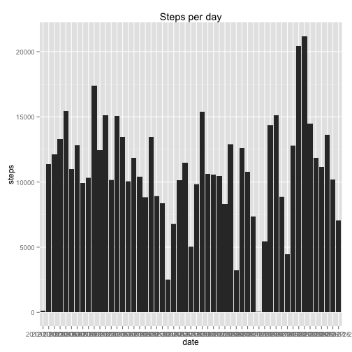
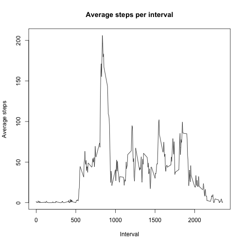
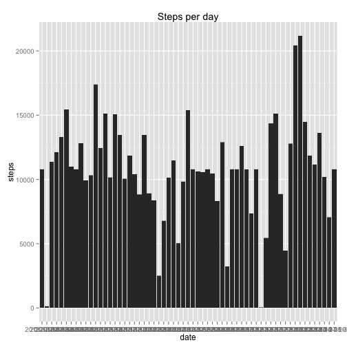
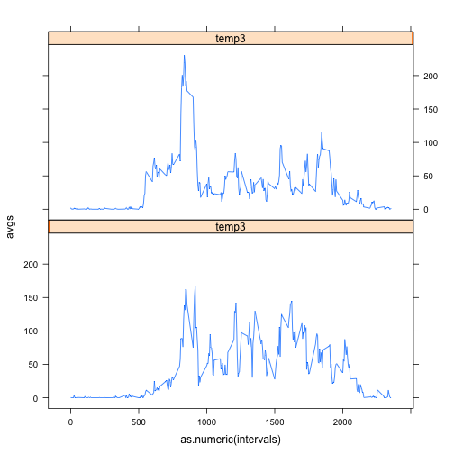

# Reproducible Research: Peer Assessment 1

Here are the global settings I used:

```r
opts_chunk$set(echo=TRUE)
options(digits=7)
library(ggplot2)
library(lattice)
```

## Loading and preprocessing the data

Note that I process the data to remove all NA entries

```r
activity = read.csv("activity.csv")
activityNoNA = na.omit(activity)
```

## What is mean total number of steps taken per day?

The following is a histogram showing the number of steps taken per day
(disregarding days for which there is no data):

```r
ggplot(activityNoNA, aes(x = date, y = steps)) + geom_histogram(stat = "identity") +
  labs(title = "Steps per day")
```

 

To calculate the mean and median, I break my dataframe into parts by day, get 
the sum for each part, add it to a vector, and apply the operation:

```r
activityNoNA2 <- split(activityNoNA, as.Date(activityNoNA$date))
stepsPerDay <- numeric()
for (name in names(activityNoNA2)) {
  stepsPerDay <- c(stepsPerDay, sum(activityNoNA2[[name]]$steps))
}
mean(stepsPerDay)
```

```
## [1] 10766.19
```

```r
median(stepsPerDay)
```

```
## [1] 10765
```

## What is the average daily activity pattern?

In order to graph the average for each time interval, I split the original 
dataframe into parts by interval, get the average for each part, add it to a 
vector, and plot the result:

```r
activityNoNA3 <- split(activityNoNA, activityNoNA$interval)
avgStepsPerInterval <- numeric()
for (name in names(activityNoNA3)) {
  avgStepsPerInterval <- c(avgStepsPerInterval, mean(activityNoNA3[[name]]$steps))
}
plot(names(activityNoNA3), avgStepsPerInterval, type="l", 
     main="Average steps per interval", xlab="Interval", ylab="Average steps")
```

 

To determine which interval has the maximum average number of steps, we simply
find the index of maximum value in `avgStepsPerInterval`, go to that index in
`activityNoNA3`, and get the value of the interval.

```r
activityNoNA3[[which.max(avgStepsPerInterval)]]$interval[1]
```

```
## [1] 835
```

## Imputing missing values

To find the number of missing values, we create a vector of booleans
representing the presence of NAs in the row (meaning NAs are TRUE) and sum the
entries in the vector:

```r
numberMissing <- is.na(activity$steps)
sum(numberMissing)
```

```
## [1] 2304
```

In order to replace the missing values, we will determine the interval of the
value and substitute in the average number of steps for that interval. This
choice of substitute value is convenient because we just calculated those
averages in the previous part of this assignment. We will perform the the
substitution by iterating through the rows in the original data frame and
putting the values in a vector, modifying any rows which are missing data. We
then replace the old column with the constructed vector.

```r
activity2 <- activity
replacement <- numeric()
i <- 0
for (row in activity$steps) {
  if (is.na(row)) {
    replacement <- c(replacement, avgStepsPerInterval[(i%%length(avgStepsPerInterval))+1])
  }
  else {
    replacement <- c(replacement, row)
  }
  i <- i+1
}
activity2$steps <- replacement
```

We now use this new dataset to repeat the creation of a histogram representing
the total number of steps taken each day:

```r
ggplot(activity2, aes(x = date, y = steps)) + geom_histogram(stat = "identity") +
  labs(title = "Steps per day")
```

 

We calculate the mean and median of this data as before:

```r
activity3 <- split(activity2, as.Date(activity2$date))
stepsPerDay2 <- numeric()
for (name in names(activity3)) {
  stepsPerDay2 <- c(stepsPerDay2, sum(activity3[[name]]$steps))
}
mean(stepsPerDay2)
```

```
## [1] 10766.19
```

```r
median(stepsPerDay2)
```

```
## [1] 10766.19
```
Notice that the mean is the same as before, and the median is almost identical.
By replacing the missing data with the average for each interval, the interval
averages remain the same. The overall mean is just the sum of the interval
averages, so it is the same as well. However, the median changes because we have
added entire days with total steps equal to the mean.

## Are there differences in activity patterns between weekdays and weekends?

To check for differences in behavior on weekdays versus weekends, we first need
to classify each day. We make a function to do this and apply it to each date in
the data set, collecting the results in a new column:

```r
weekday <- function(day) {
  day <- weekdays(as.Date(day))
  if (day == "Saturday" || day == "Sunday") {
    FALSE
  }
  else {
    TRUE
  }
}
status <- sapply(activity2$date, weekday)
activity2$day <- factor(status, labels=c("weekend", "weekday"))
```

We then calculate the average steps per time interval per level:

```r
activity4 <- split(activity2, activity2$day)
activity5 <- split(activity4[[1]], activity4[[1]]$interval)
activity6 <- split(activity4[[2]], activity4[[2]]$interval)
avgStepsPerIntervalWeekend <- numeric()
avgStepsPerIntervalWeekday <- numeric()
for (name in names(activity5)) {
  avgStepsPerIntervalWeekend <- c(avgStepsPerIntervalWeekend, mean(activity5[[name]]$steps))
}
for (name in names(activity6)) {
  avgStepsPerIntervalWeekday <- c(avgStepsPerIntervalWeekday, mean(activity6[[name]]$steps))
}
temp1 <- numeric(288)
temp2 <- rep(1, 288)
temp3 <- c(temp1, temp2)
interval <- names(activity5)
intervals <- c(interval, interval)
avgs <- c(avgStepsPerIntervalWeekend, avgStepsPerIntervalWeekday)
newData <- cbind(intervals, avgs, temp3)
xyplot(avgs ~ as.numeric(intervals) | temp3, type="l", layout=(c(1,2)))
```

 
